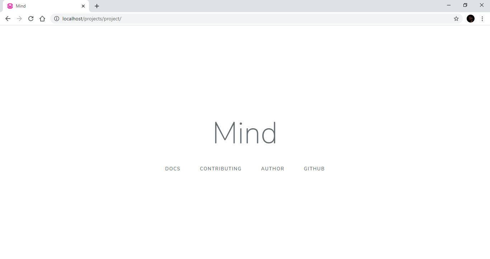

# Mind 


Mind is the PHP code framework designed for developers. It offers a variety of solutions for creating design patterns, applications and code frameworks.  

* [Documents](https://github.com/aliyilmaz/Mind/blob/main/docs) 
  * [Turkish ](https://github.com/aliyilmaz/Mind/blob/main/docs/tr-readme.md) 
  * [English](https://github.com/aliyilmaz/Mind/blob/main/docs/en-readme.md) 
* [Tests](https://github.com/aliyilmaz/Mind/blob/main/tests) 

## Requirements

* PHP 5.6.0 or High (Including 8.2.0 and above.)
* Database (PDO mysql, sqlite, sqlserver) Or without a database.
* Web Server (Apache, Microsoft IIS, LiteSpeed, Nginx)

## Install

  * Download the [repository](https://github.com/aliyilmaz/project/archive/refs/heads/main.zip) and extract it to the server.

  or composer 
```php
composer require mind/mind
```

  * Adjust [database settings](https://github.com/aliyilmaz/Mind/blob/main/docs/en-readme.md#database-settings)
  * In the address line, type the path to the directory.


## Security

If you find any security issues, please email aliyilmaz.work@gmail.com instead of using the public issue notifier.

## Screenshots

#### Home Page
[](https://github.com/aliyilmaz/Mind)

#### Error Page
[](https://github.com/aliyilmaz/Mind)

## Author

- [Ali Yılmaz](https://github.com/aliyilmaz)

## Contributors

- [Contributors](https://github.com/aliyilmaz/Mind/graphs/contributors)

## License

Mind is licensed under General Public License version 3. [GPLv3 license](license.md).
